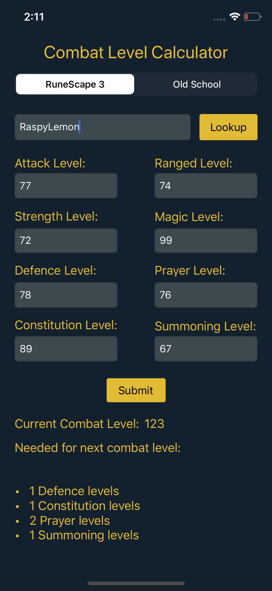

# RuneScape Combat Level Calculator

## This is a combat level calculator for [RuneScape](https://www.runescape.com/community), a popular fantasy MMORPG. Both RuneScape 3 and Old School RuneScape formulae are supported.

Combat level is a number calculated using a player's stats to show roughly how difficult they are to defeat. Combat level is calculated by taking the following skills into account:

* Attack and Strength, or Ranged, or Magic
* Defence
* Constitution
* Prayer
* Summoning

#### Users can lookup players to autofill their data, then submit it to calculate their current combat level and what levels are needed to reach the next combat level. Player data is fetched from RuneScape's Hiscores APIs using Alamofire. Data can also be manually entered if player is not on the Hiscores. The combat level formula is different for both versions of the game.

&nbsp;

&nbsp;&nbsp;&nbsp;&nbsp;&nbsp;&nbsp;&nbsp;&nbsp;&nbsp;&nbsp;

&nbsp;

&nbsp;&nbsp;&nbsp;&nbsp;&nbsp;&nbsp;&nbsp;&nbsp;&nbsp;&nbsp;

&nbsp;

&nbsp;&nbsp;&nbsp;&nbsp;&nbsp;&nbsp;&nbsp;&nbsp;&nbsp;&nbsp;

&nbsp;

### RuneScape 3 (RS3) Combat Level Formula

&nbsp;

### Old School RuneScape (OSRS) Combat Level Formula

